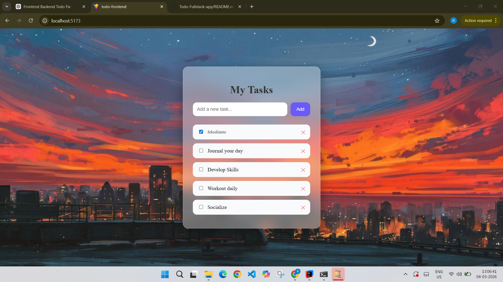

# Full Stack Todo Application

**Live Demo:**  
 https://todo-fullstack-deploy.onrender.com

## Overview

This is a **Full Stack Todo Application** built using **Spring Boot, PostgreSQL, and React (Vite)**.
The project demonstrates complete **CRUD operations**, backend–frontend communication, and persistent storage using PostgreSQL.

---


### Task Added Example


---

# Tech Stack

## Backend

* Java 17
* Spring Boot
* Spring Data JPA
* REST APIs
* Maven

## Frontend

* React (Vite)
* Axios
* CSS

## Database

* PostgreSQL

## Containerization

* Docker

---

# Features

* Create new todo
* Fetch all todos
* Update existing todo
* Delete todo
* Persistent storage using PostgreSQL
* RESTful API architecture
* React frontend connected to Spring Boot backend

---

# Project Structure

```
Todo-Fullstack-App
│
├── Backend
│     └── Spring Boot REST API
│
├── Frontend
│     └── React + Vite Application
│
└── Dockerfile
      └── Container configuration
```

---

# API Endpoints

| Method | Endpoint      | Description     |
| ------ | ------------- | --------------- |
| GET    | `/todos`      | Fetch all todos |
| POST   | `/todos`      | Create new todo |
| PUT    | `/todos/{id}` | Update todo     |
| DELETE | `/todos/{id}` | Delete todo     |

---

# How to Run Locally

## 1. Start Backend

Navigate to the **Backend** folder.

Run:

```
./mvnw spring-boot:run
```

Backend runs on:

```
http://localhost:8080
```

You can test the API at:

```
http://localhost:8080/todos
```

---

## 2. Start Frontend

Navigate to the **Frontend** folder.

Install dependencies:

```
npm install
```

Start the development server:

```
npm run dev
```

Frontend runs on:

```
http://localhost:5173
```

---

## 3. Open the Application

Open the browser and visit:

```
http://localhost:5173
```

The React frontend communicates with the Spring Boot backend running on **port 8080**.

---

# What This Project Demonstrates

* REST API development using Spring Boot
* Database integration using PostgreSQL and JPA
* Frontend–backend communication
* Full-stack application architecture
* Containerization using Docker

---

# Author

Developed by **Ruchika N**


